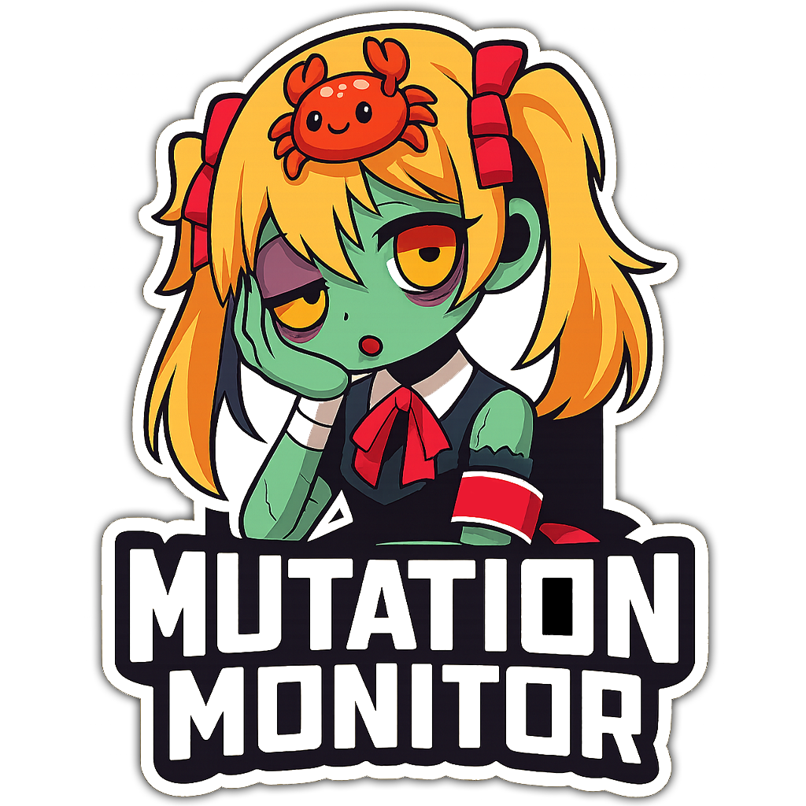

<div align="center">
  
  <h1>Mutation Monitor</h1>
  <p>Observe mutations of a value and generate a callback when the value has mutated.</p>
</div>

This is a very simple crate with minimal intrustion to your codebase that watches for any mutations within your defined structures. It then monitors those structures and reports to you based on changes.

We watch for changes via `OnMutate<T>`, which stores your value inside a `RefCell<T>`, to later recall the data you provided. Every time your data mutates, it'll clone the "old" value, allow you to finish mutating, and then checks with `PartialEq` to validate the data was actually modified. If the data is successfully changed, a `Mutate<T>` event is created with the following values for reference: `old`, `new`, and `tag`. Beyond this, all events are queued. Which means nothing is delivered until all borrows are released.

## Usage

Import Mutation Monitor into your project:
```toml
[dependencies]
mutation-monitor = "0.1"
```

How to use in your project:
```rust
use mutation_monitor::{Mutate, OnMutate};
```

## API

| Function                         | Description                                                      |
|----------------------------------|------------------------------------------------------------------|
| `get_val()`                      | Get a clone of the current value                                 |
| `with_guard()`                   | Returns a guard; when it drops, we compare old vs new and notify |
| `replace(new_value: T)`          | Replace the entire value; notify if different                    |
| `with_tag(tag: String)`          | Add a context tage during push, not intial mutation              |
| `with_mut<R>(tag: String, f: T)` | Mutate; notify once if changed + add a context tag if applicable |

NOTE: This API list is a "dumbed down" version of all supported functions, but it should give a high level overview of what to expect when using the library.

Example 
```rust
use mutation_monitor::{Mutate, OnMutate};

/// A simple numerical for loop iterating until reaching 100
fn main() {
  for i in 1..=100 {
    let on = OnMutate::new(i, move |evt: &Mutate<i32>| {
      println!("{:?}", evt.tag);

      // Specific data options
      // println!("Old: {}", evt.old); // old
      // println!("new: {}", evt.new); // new
      // if let Some(s) = &evt.tag { println!("Tag: {}", s); } // tag
    });

    let mut iter_tag = format!("Current Value: {}", i.to_string());

    // Simple iteration check to change the tag
    if on.get_val() == 50 {
      iter_tag = format!("Halfway: {}", i.to_string());
    }

    // Every single iteration, we double the value
    // Example: 50 => 100
    on.with_mut(iter_tag, |v| *v += i);
  }
}
```

<!-- If you want learn more about **Mutation Monitor**, check out this project I created called [Jsock](https://github.com/umikoio/jsock) that showcases how this crate can be integrated into a project. -->

>[!IMPORTANT]
> There are still a few limitations
> * `T` must be `Clone + PartialEq`
> * Uses `RefCell`, so no `Sync`/`Async`; Multi-threading is not currently implemented
> * Detection relies on `PartialEq`. If your type has tricky equality (like floats with `NaN`), you may need to re-evaluate how certain data is handled
